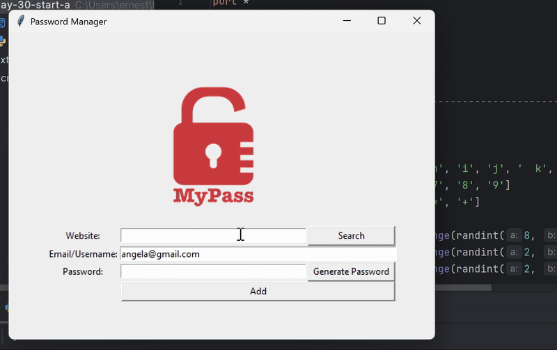

<h1>Day 30 of the 100 Days of Code: The Complete Python Pro Bootcamp</h1>

For the Day 30 challenge, I updated the Password Manager with more enhanced features. This is a culmination of the teaching points that were shared in the tutorial, including the following but not limited to

<ul>
  <li>Try, Except, Else, Finally and Raise functions to manage error situations</li>
  <li>Json library to manage, update and create Json files</li>
  <li>Conditional statements</li>
</ul>

> [!TIP]
> Json files, which has a format similiar to dictionaries, allows for easier management and storage of data. 
 

  

<h2>Why am I doing this?</h2>

I have learned python before in school but I hope to revisit some of the python concepts that I may have forgotten and at the same time delve further into python, especially in the field of data science and visualisation.

<h2>You can join me too!</h2>

 Check out the 100 Days of Code: The Complete Python Pro Bootcamp udemy course through this <a href="https://www.udemy.com/course/100-days-of-code/">link</a>.

